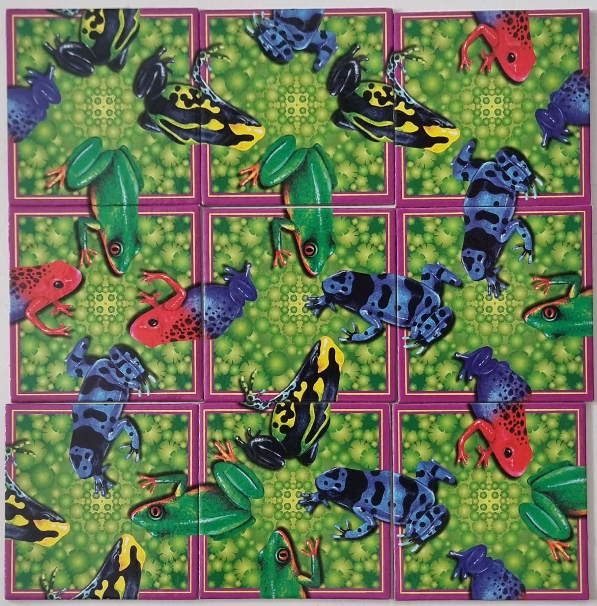

# Scramble Squares Puzzle Solver
The algorithm to find all solutions to a generic scramble squares puzzle is inspired by how one solves the Rubiks cube.

The algorithm was created when we found a frog puzzle at my over at my friend's cottage. Since we wanted to solve the puzzle the same evening, with a beer and some determination, the algorithm was created. In the case of this algorithm, the cards hold 4  `Frogs` but it can just as easily solve a generic version of the scramble squares puzzle.

The algorithm takes 9 cards with 4 frogs on each card. Each frog is specified with the type (head or tail) and a color. The output of the algorithm is all the possible solutions to that set of cards.

